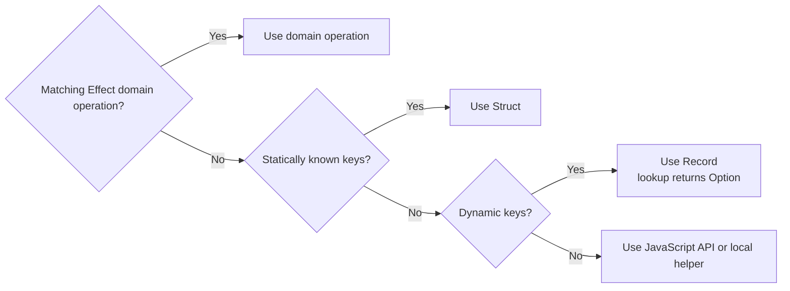

# Effect operations



## Domain operations

```ts
// BAD
pipe(name, value => value.length)

// GOOD
pipe(name, String.length)
```

```ts
// BAD
pipe(items, value => value.length)

// GOOD
pipe(items, Array.length)
```

```ts
// BAD
pipe(
	users,
	Array.filter(user => user.active)
)

// GOOD
pipe(users, Array.filter(Struct.get('active')))
```

```ts
// BAD
pipe(user, value => ({id: value.id, name: value.name}))

// GOOD
pipe(user, Struct.pick(['id', 'name']))
```

```ts
// BAD
const {password: _, ...publicUser} = user

// GOOD
const publicUser = pipe(user, Struct.omit(['password']))
```

```ts
// BAD
pipe(user, value => ({...value, name: String.trim(value.name)}))

// GOOD
pipe(user, Struct.evolve({name: String.trim}))
```

```ts
// BAD
pipe(flags, value => value[key])

// GOOD
pipe(flags, Record.get(key))
```

## Composition

```ts
// BAD
const normalize = (input: Input) => pipe(input, decode, validate, persist)

// GOOD
const normalize = flow(decode, validate, persist)
```

| Decision shape             | Operation                                           |
| -------------------------- | --------------------------------------------------- |
| Reusable pure predicate    | `Predicate.and`, `Predicate.or`, or `Predicate.not` |
| Inline control or JSX gate | `&&` or `\|\|`                                      |
| Value fallback             | `??` or `\|\|`                                      |

## Evaluate once

```ts
// BAD
return Effect.all({
	audit: audit(yield * authorize(input.session.user.id)),
	view: render(yield * authorize(input.session.user.id))
})

// GOOD
const permissions = yield * authorize(input.session.user.id)

return Effect.all({audit: audit(permissions), view: render(permissions)})
```

## Module map

| Domain        | Modules                                                                                                                                                |
| ------------- | ------------------------------------------------------------------------------------------------------------------------------------------------------ |
| Composition   | `Function` · `Effect` · `Stream` · `Channel` · `Sink`                                                                                                  |
| Values        | `String` · `Number` · `Boolean` · `Array` · `Record` · `Struct` · `Tuple` · `Iterable` · `Data`                                                        |
| Decisions     | `Predicate` · `Filter` · `Match` · `Order` · `Ordering` · `Equivalence` · `Equal` · `Hash`                                                             |
| Outcomes      | `UndefinedOr` · `Option` · `Result` · `Exit` · `Cause`                                                                                                 |
| Collections   | `HashMap` · `HashSet` · `Chunk`                                                                                                                        |
| Schema        | `Schema` · `SchemaAST` · `SchemaGetter` · `SchemaIssue` · `SchemaParser` · `SchemaRepresentation` · `SchemaTransformation` · `JsonSchema` · `Encoding` |
| Configuration | `Config` · `ConfigProvider` · `Redacted` · `PlatformError`                                                                                             |
| Time          | `Duration` · `DateTime` · `Clock` · `Schedule`                                                                                                         |
| State         | `Ref` · `SubscriptionRef` · `SynchronizedRef` · `Queue` · `PubSub`                                                                                     |
| Resources     | `Scope` · `Resource` · `Cache` · `ScopedCache` · `RcMap` · `RcRef` · `LayerMap` · `Pool`                                                               |
| Concurrency   | `Deferred` · `Semaphore` · `Fiber` · `FiberHandle` · `FiberMap` · `FiberSet` · `Request` · `RequestResolver`                                           |
| Observability | `Logger` · `LogLevel` · `Metric` · `Tracer`                                                                                                            |
| Runtime       | `Context` · `Layer` · `ManagedRuntime` · `Runtime`                                                                                                     |
| Platform      | `FileSystem` · `Path` · `Console` · `Terminal` · `Random` · `Crypto`                                                                                   |

| Entrypoint                   | Material modules                                                                                                                                                |
| ---------------------------- | --------------------------------------------------------------------------------------------------------------------------------------------------------------- |
| `effect/unstable/reactivity` | `Atom` · `AsyncResult` · `AtomRpc` · `AtomRegistry` · `AtomRef` · `Reactivity` · `Hydration` · `AtomHttpApi`                                                    |
| `effect/unstable/rpc`        | `Rpc` · `RpcGroup` · `RpcSchema` · `RpcClient` · `RpcServer` · `RpcSerialization` · `RpcMessage` · `RpcMiddleware` · `RpcClientError` · `RpcTest` · `RpcWorker` |
| `effect/unstable/ai`         | `Model` · `LanguageModel` · `EmbeddingModel` · `Tokenizer` · `Chat` · `Prompt` · `Response` · `Tool` · `Toolkit` · `AiError` · `Telemetry`                      |
| `effect/unstable/http`       | `HttpServer` · `HttpRouter` · `HttpServerRequest` · `HttpServerResponse` · `HttpMiddleware` · `HttpClient` · `HttpClientRequest` · `HttpClientResponse`         |
| `effect/unstable/httpapi`    | `HttpApi` · `HttpApiGroup` · `HttpApiEndpoint` · `HttpApiSchema` · `HttpApiBuilder` · `HttpApiClient`                                                           |
| `effect/unstable/process`    | `ChildProcess` · `ChildProcessSpawner`                                                                                                                          |
| `effect/unstable/socket`     | `Socket` · `SocketServer`                                                                                                                                       |
| `effect/unstable/cli`        | `Command` · `Argument` · `Flag` · `Param` · `Primitive` · `CliConfig` · `CliError` · `CliOutput`                                                                |

## Operation shape

| Shape                                | Primitive                                        |
| ------------------------------------ | ------------------------------------------------ |
| Pure reusable composition            | `flow`                                           |
| Immediate linear composition         | `pipe`                                           |
| Argument + direct delegation         | Arrow                                            |
| Argument + branching or sequencing   | `Effect.fnUntraced`                              |
| Callback that constructs an Effect   | `Effect.fnUntraced`                              |
| Argument + public service checkpoint | Named `Effect.fn`                                |
| Zero-input branching or sequencing   | `Effect.gen`                                     |
| Zero-input traced checkpoint         | Name-first `Effect.withSpan` around `Effect.gen` |

```ts
// BAD
save: input =>
	Effect.gen(function* () {
		return yield* storage.save(input)
	})

// GOOD
save: input => storage.save(input)
```

```ts
// BAD
save: input =>
	pipe(
		storage.read(input.id),
		Effect.flatMap(current => (current.value === input.value ? Effect.succeed(current) : storage.write(input)))
	)

// GOOD
save: Effect.fnUntraced(function* (input) {
	const current = yield* storage.read(input.id)

	if (current.value === input.value) return current

	return yield* storage.write(input)
})
```

```ts
// BAD
refresh: Effect.fn('Items.refresh')(function* () {
	yield* storage.clear
	yield* storage.load
})()

// GOOD
refresh: Effect.withSpan('Items.refresh')(
	Effect.gen(function* () {
		yield* storage.clear
		yield* storage.load
	})
)
```

## Trace ownership

| Operation                              | Owner             |
| -------------------------------------- | ----------------- |
| Public service logic                   | Named `Effect.fn` |
| Direct delegation to traced logic      | Existing span     |
| Distinct costly or failure-prone stage | One named span    |
| Pure transformation                    | None              |
| Finite unowned Stream operation        | `Stream.withSpan` |

```ts
// BAD
const exported = pipe(
	documents,
	Stream.mapEffect(document => storage.export(document))
)

// GOOD
const exported = Stream.withSpan('Document.exportAll')(
	pipe(
		documents,
		Stream.mapEffect(document => storage.export(document), {concurrency})
	)
)
```

## Failure accumulation

```ts
// BAD: contract requires every operation
return yield * Effect.forEach(input.ids, repository.read, {concurrency: input.concurrency})

// GOOD: contract requires every operation
return yield * Effect.validate(input.ids, repository.read, {concurrency: input.concurrency})
```
